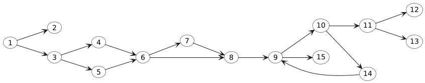

# T3 – Testare Unitară în Java

## Cuprins

- [Despre proiect](#despre-proiect)
- [Mediu de lucru](#mediu-de-lucru)
- [Testare Funcțională (Black-Box)](#testare-funcțională-black-box)
- [Testare Structurală (White-Box)](#testare-structurală-white-box)
- [Mutation Testing](#mutation-testing)
- [Rezultate și Dovezi](#rezultate-și-dovezi)
- [Video, Raport AI și Bibliografie](#video-raport-ai-și-bibliografie)

## Despre proiect

Funcția pe care am testat-o se numește `calculateGrade(int score, int bonus, boolean extraCredit)` și calculează calificativul (nota finală) al unui student pe baza următoarelor criterii:

- **Parametrul `score`**: Punctajul obținut de student (0-100). Orice valoare sub 0 sau peste 100 aruncă excepție.
- **Parametrul `bonus`**: Puncte suplimentare pe care le poate obține studentul (ex. puncte extra pentru teme).
- **Parametrul `extraCredit`**: Flag boolean care, dacă este `true`, adaugă 5 puncte suplimentare la total.

**Procesul de calcul:**
1. Validează scorul (trebuie să fie între 0 și 100 inclusiv).
2. Calculează totalul: `total = score + bonus + (extraCredit ? 5 : 0)`.
3. Plafonează totalul la maxim 105 puncte.
4. Compară totalul cu pragurile de note și returnează calificativul corespunzător:
   - **A+ (Excelenț)**: total ≥ 90 și `extraCredit = true`
   - **A (Foarte bine)**: total ≥ 90
   - **B (Bine)**: total ≥ 80
   - **C (Satisfăcător)**: total ≥ 70
   - **D (Admis)**: total ≥ 60
   - **F (Picată)**: total < 60


## Mediu de lucru

**Software:**

- Java 11 sau superior
- Apache Maven 3.9.x
- JUnit 5.10.2
- JaCoCo 0.8.12 (pentru Code Coverage)
- PITest 1.16.1 (pentru Mutation Testing)

**Hardware și OS:**

- MacBook Air M2
- macOS Tahoe 26.0.1

## Testare Funcțională (Black-Box)

### 1. Partiționarea în Clase de Echivalență (Equivalence Partitioning)

Am împărțit domeniul de intrare în clase valide și invalide, reducând numărul de teste necesare prin alegerea unui singur reprezentant din fiecare clasă.

**Clase Individuale de Intrare (cu limite efective):**

- **Parametrul Score:**
  - S1 (Validă): Valori cuprinse între 0 și 100 inclusiv `[0, 100]`.
  - S2 (Invalidă): Valori mai mici ca zero `< 0`.
  - S3 (Invalidă): Valori mai mari ca o sută `> 100`.
- **Parametrul Bonus:**
  - B1 (Validă): Orice număr întreg.
- **Parametrul ExtraCredit:**
  - E1 (Validă): `True`
  - E2 (Validă): `False`

**Clase Globale de Echivalență (combinații esențiale testate):**
Din combinațiile claselor individuale au rezultat 8 scenarii de test esențiale (Domeniul de Ieșiri):

- **CG_Invalid**: Orice scor sub 0 sau peste 100 aruncă excepție, indiferent de ceilalți parametri.
- **CG_Nota_A+**: Scor valid, extraCredit activat, iar punctajul total cumulat atinge minim 90.
- **CG_Nota_A**: Scor valid, fără extraCredit, cu punctaj total minim 90.
- **CG_Nota_B / C / D**: Scor valid, cu totaluri situate în limitele intervalelor matematice `[80, 89]`, `[70, 79]`, și respectiv `[60, 69]`.
- **CG_Nota_F**: Scor valid, dar cu totalul obținut strict sub limita de 60.

### 2. Analiza Valorilor de Frontieră (Boundary Value Analysis)

Deoarece erorile umane apar frecvent la limite (condiții de tip off-by-one), am testat fiecare graniță folosind 3 valori (sub limită, exact pe limită, peste limită).

**Limitele Efective Testate:**

1. **Limitele parametrului Score:**
   - Frontiera inferioară **0**: am testat -1, 0, 1.
   - Frontiera superioară **100**: am testat 99, 100, 101.
2. **Limitele (Pragurile) Notelor:**
   - Trecerea F/D (frontiera **60**): am testat 59, 60, 61.
   - Trecerea D/C (frontiera **70**): am testat 69, 70, 71.
   - Trecerea C/B (frontiera **80**): am testat 79, 80, 81.
   - Trecerea B/A (frontiera **90**): am testat 89, 90, 91.
3. **Limita de plafonare:**
   - Frontiera de plafon (limita maximă) **105**: am testat 104, 105 și scenarii în care suma trece mult peste 105 (ex: 120).

---

## Testare Structurală (White-Box)

Această etapă de testare a fost realizată analizând direct codul sursă scris, structura acestuia și modul în care informația circulă prin program.

### Transformarea programului într-un graf orientat (CFG)



**Legenda nodurilor din graf:**

- 1 = decizie de validare score
- 2 = aruncare excepție (scor invalid)
- 3 = decizie extraCredit
- 4 = instrucțiune adunare total cu +5
- 5 = instrucțiune adunare total fără +5
- 6 = decizie plafonare total > 105
- 7 = instrucțiune de plafonare la 105
- 8 = inițializări (array-uri și pregătire înainte de buclă)
- 9 = decizia buclei (iterarea array-ului)
- 10 = decizie verificare prag de notă
- 11 = decizie verificare condiție de A+
- 12 = instrucțiune return A+
- 13 = instrucțiune return nota curentă găsită
- 14 = instrucțiune trecere la următoarea iterație din buclă (i++)
- 15 = instrucțiune return F (dacă bucla se încheie fără să găsească o notă)

---

### 1. Acoperire la Nivel de Instrucțiune (Statement Coverage)

Această tehnică ne obligă să avem teste care, puse cap la cap, execută și vizitează absolut fiecare instrucțiune (fiecare nod din graf) măcar o singură dată. Nivelul acesta este considerat minimul necesar, scopul fiind doar să ne asigurăm că nu există "cod mort" în aplicație. Baza pentru a atinge Statement Coverage 100% este vizitarea fiecarui nod din graf.

```java
// 1. Viziteaza nod 1, 2: throw exception
@Test
void testExceptieScoreInvalid() {
    assertThrows(IllegalArgumentException.class, () ->
        Calculator.calculateGrade(-5, 0, false));
}

// 2. Viziteaza nod 3, 4: if (extraCredit) ramura TRUE
@Test
void testExtraCreditTrue() {
    assertEquals("B", Calculator.calculateGrade(80, 0, true));
}

// 3. Viziteaza nod 6, 7: if (total > 105) ramura TRUE
@Test
void testLimitareTotal105() {
    assertEquals("A", Calculator.calculateGrade(100, 20, false));
}

// 4. Viziteaza nod 11, 12: if (thresholds[i] == 90 && extraCredit) ramura TRUE
@Test
void testNotaAPlus() {
    assertEquals("A+", Calculator.calculateGrade(90, 0, true));
}

// 5. Viziteaza nod 14, 15: bucla se epuizeaza, return F
@Test
void testNotaF() {
    assertEquals("F", Calculator.calculateGrade(30, 0, false));
}
```

### 2. Acoperire la Nivel de Decizie/Ramură (Branch Coverage)

Această etapă este superioară acoperirii de instrucțiuni. Din fiecare nod de decizie (romb) trebuie să plecăm cel puțin o dată pe varianta Adevărat (True) și cel puțin o dată pe varianta Fals (False).

```java
// Decision 1: Validare score (score < 0 || score > 100)
@Nested
class D1_ValidareScore {
    @Test
    void d1True() {  // TRUE: score invalid
        assertThrows(IllegalArgumentException.class, () ->
            Calculator.calculateGrade(-1, 0, false));
    }
    // Noduri: 1 → 2
    
    @Test
    void d1False() {  // FALSE: score valid
        assertEquals("F", Calculator.calculateGrade(50, 0, false));
    }
    // Noduri: 1 → 3 → ... → 15
}

// Decision 2: Extra credit (extraCredit)
@Nested
class D2_ExtraCredit {
    @Test
    void d2True() {  // TRUE: extra=true
        assertEquals("C", Calculator.calculateGrade(65, 0, true));
    }
    // Noduri: 1 → 3 → 4 → 6 → 8 → 9 → 10 → 13
    
    @Test
    void d2False() {  // FALSE: extra=false
        assertEquals("D", Calculator.calculateGrade(65, 0, false));
    }
    // Noduri: 1 → 3 → 5 → 6 → 8 → 9 → 10 → 13
}

// Decision 3: Limitare total (total > 105)
@Nested
class D3_LimitareTotal {
    @Test
    void d3True() {  // TRUE: total > 105
        assertEquals("A", Calculator.calculateGrade(100, 20, false));
    }
    // Noduri: 1 → 3 → 5 → 6 → 7 → 8 → 9 → 10 → 13
    
    @Test
    void d3False() {  // FALSE: total ≤ 105
        assertEquals("C", Calculator.calculateGrade(75, 0, false));
    }
    // Noduri: 1 → 3 → 5 → 6(F) → 8 → 9 → 10 → 13
}

// Decision 4: Condiția buclei (i < 4)
@Nested
class D4_BuclaFor {
    @Test
    void d4TrueGaseste() {  // TRUE: se intra in bucla
        assertEquals("A", Calculator.calculateGrade(95, 0, false));
    }
    // Noduri: ... → 9(T) → 10(T) → 13 (exit buclă)
    
    @Test
    void d4FalseEpuizare() {  // FALSE: se epuizeaza bucla (intoarce F)
        assertEquals("F", Calculator.calculateGrade(30, 0, false));
    }
    // Noduri: ... → 9(F) → 15 (exit buclă)
}

// Decision 5: Verificare prag (total >= thresholds[i])
@Nested
class D5_VerificarePrag {
    @Test
    void d5True() {  // TRUE: total >= prag
        assertEquals("B", Calculator.calculateGrade(85, 0, false));
    }
    // Noduri: ... → 10(T) → 13 (return nota)
    
    @Test
    void d5False() {  // FALSE: total < prag
        assertEquals("B", Calculator.calculateGrade(85, 0, false));
    }
    // Noduri: ... → 10(F) → 14 → 9 (urmatoarea iteratie)
}

// Decision 6: Condiție A+ (thresholds[i] == 90 && extraCredit)
@Nested
class D6_ConditiaAPlus {
    @Test
    void d6True() {  // TRUE: ambele condiții true
        assertEquals("A+", Calculator.calculateGrade(90, 0, true));
    }
    // Noduri: ... → 11(T) → 12 (return A+)
    
    @Test
    void d6False() {  // FALSE: cel puțin una falsa
        assertEquals("A", Calculator.calculateGrade(95, 0, false));
    }
    // Noduri: ... → 11(F) → 13 (return nota)
}
```
### 3. Acoperire la Nivel de Condiție și MC/DC (Condition Coverage)

În program avem două locuri unde se folosesc condiții compuse (combinate cu OR `||` și AND `&&`). Branch Coverage tratează doar decizia per ansamblu, dar noi vrem să ne asigurăm că fiecare sub-condiție afectează rezultatul individual, conform tehnicii Modified Condition / Decision Coverage.

**Decizia D1 (Nodul 1 - Condiție de tip OR): `score < 0 || score > 100`**
Avem două sub-condiții (C1: `score < 0`, C2: `score > 100`). Am făcut teste demonstrative care țin o condiție pe loc și o variază pe cealaltă:

```java
// C1 = False, C2 = True => Decizie = True
@Test
void t1_c1False_c2True() {
    assertThrows(IllegalArgumentException.class, () ->
        Calculator.calculateGrade(101, 0, false));
}

// C1 = True, C2 = False => Decizie = True
@Test
void t2_c1True_c2False() {
    assertThrows(IllegalArgumentException.class, () ->
        Calculator.calculateGrade(-1, 0, false));
}

// C1 = False, C2 = False => Decizie = False (caz de bază)
@Test
void t3_c1False_c2False() {
    assertEquals("F", Calculator.calculateGrade(50, 0, false));
}
```

**Decizia D6 (Nodul 11 - Condiție de tip AND): `thresholds[i] == 90 && extraCredit`**
Pentru a primi nota A+ trebuie ca ambele părți să fie corecte (C3: `thresholds[i] == 90`, C4: `extraCredit`):

```java
// C3 = True, C4 = True => Decizie = True (caz de bază A+)
@Test
void t4_c3True_c4True() {
    assertEquals("A+", Calculator.calculateGrade(90, 0, true));
}

// C3 = True, C4 = False => Decizie = False
@Test
void t5_c3True_c4False() {
    assertEquals("A", Calculator.calculateGrade(95, 0, false));
}

// C3 = False, C4 = True => Decizie = False
@Test
void t6_c3False_c4True() {
    assertEquals("B", Calculator.calculateGrade(77, 0, true));
}
```

### 4. Testarea Circuitelor Independente

Așa cum am calculat folosind formula McCabe `V(G) = 5`, trebuie să planificăm 5 căi de la cap la coadă în program care nu se suprapun identic.

**Cele 5 circuite parcurse (explicate logic):**

- **Circuitul 1 (Calea de bază):** Este traseul cel mai lung. Îi dăm aplicației o notă mică fără niciun fel de bonus (score 30). Programul trece prin validare, ignoră bonusurile, ignoră plafonarea, intră în buclă unde ratează absolut toate pragurile unul câte unul, iese din buclă și moare la ultimul nod (15), returnând nota F.
- **Circuitul 2 (Scurtătura spre Eroare):** Față de traseul 1, îi dăm din prima o notă ilegală. Programul deviază imediat la nodul 2, aruncând excepția, iar restul grafului este ignorat.
- **Circuitul 3 (Devierea prin Extra Credit):** Față de cazul de bază, aici aprindem condiția de extraCredit, obligând fluxul să viziteze calculul matematic de la nodul 4, obținând un B.
- **Circuitul 4 (Devierea prin Plafon):** Îi furnizăm intenționat mai multe puncte (ex: 120) încât să devieze prin nodul de tăiere al plafonului la maxim 105, întorcând un A curat.
- **Circuitul 5 (Atingerea Maximului):** Îi furnizăm și nota pentru pragul maxim, dar aprindem și extra credit-ul, astfel încât la final, în loc să ne dea un simplu A, graficul nostru deviază pe decizia completă care duce programul spre un `return A+`.

---

## Mutation Testing

Pentru a analiza cu adevărat cât de bune sunt testele pe care le-am scris, am apelat la Mutation Testing folosind plugin-ul PITest.

**Logica Procesului:** PITest introduce muntanții. Intră prin codul din spate și modifică din greșeală părți de structură. De exemplu, în loc să lase `total = score + bonus + 5`, el scrie  `total = score + bonus + 6`.
Aceasta poartă numele de mutant. Apoi rulează suita noastră de teste. Dacă testele noastre prind acest detaliu, înseamnă că **testul a omorât mutantul**, fiind așadar un test calitativ.

**Mutanți Echivalenți:** Unii mutanți nu pot fi niciodată omorâți matematic pentru că ei sunt logic identici cu originalul. Dacă mutantul transformă `if(total > 105)` în `if(total >= 105)` când totalul era de dinainte fixat ca fiind 105, comportamentul vizibil e tot același, deci rezultatul rămâne echivalent cu funcția originală. 

## Rezultate și Dovezi

- **Execuția testelor**: 88/88 Passed.
- **Code Coverage**: Avem o acoperire de linie (Line Coverage) de 94% și un 100% Branch Coverage raportat de JaCoCo.
- **Mutation Score**: Evaluarea testelor ne-a confirmat un scor global de 87% mutanți uciși la execuție (34 de defecte blocate activ din cele 39 inserate de plugin).

## Video, Raport AI și Bibliografie

- **Video:** [Link Video](https://youtu.be/s8MJVBEvsTY)
- **Raport AI:** Gemini și Claude au fost folosiți pentru consultanță teoretică referitoare la structurarea clară a claselor de echivalență și pentru scrierea scheletului de explicații ale circuitelor McCabe.
- **Bibliografie:**
  1. Materiale de curs TSS.
  2. JUnit 5 User Guide
  3. JaCoCo Documentation
  4. PITest Documentation
  5. Google Gemini, generat la 17 Mai 2026
