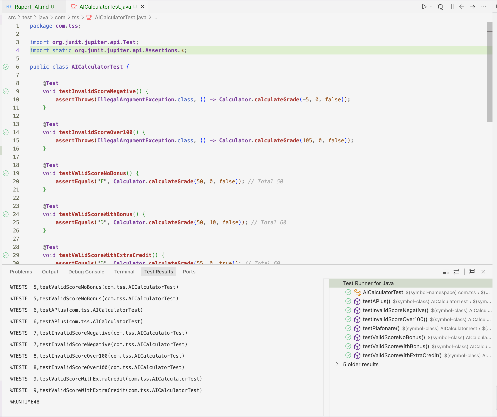
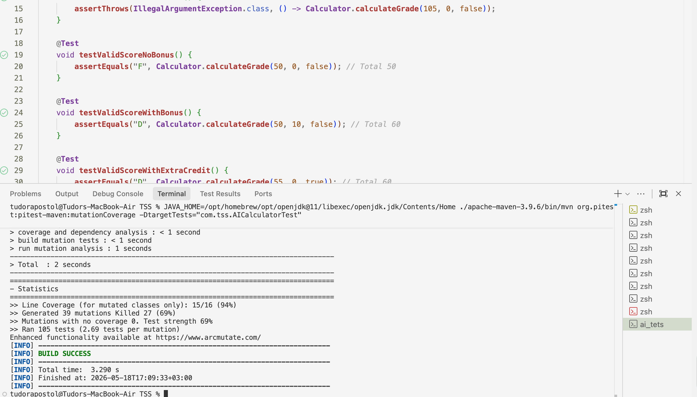

# Raport: Utilizarea Tool-urilor de AI în Testarea Software

Acest raport prezintă un studiu comparativ între suita de teste creată manual (bazată pe tehnicile academice Black-Box și White-Box) și o suită de teste generată automat folosind un asistent de Inteligență Artificială (ChatGPT) [1].

## 1. Interacțiunea cu AI-ul

Pentru a genera testele automate, am oferit modelului AI următoarea comandă.

**Prompt utilizat:**

> "scrie o suita completa de teste unitare in JUnit 5 pentru o clasa `Calculator` cu metoda `calculateGrade(int score, int bonus, boolean extraCredit)`. metoda da `IllegalArgumentException` pentru scor < 0 sau > 100, calculeaza totalul adunand scorul si bonusul, adauga +5 daca `extraCredit` e true, plafoneaza totalul la 105 si returneaza note de la F la A+ pe baza pragurilor (60=D, 70=C, 80=B, 90=A, 90+extraCredit=A+). asigura-te ca testezi functionalitatea."

**Răspuns autogenerat (Cod sursă AI):**
Modelul a răspuns rapid, generând o suită de 7 teste de bază:

```java
import org.junit.jupiter.api.Test;
import static org.junit.jupiter.api.Assertions.*;

public class AICalculatorTest {

    @Test
    void testInvalidScoreNegative() {
        assertThrows(IllegalArgumentException.class, () -> Calculator.calculateGrade(-5, 0, false));
    }

    @Test
    void testInvalidScoreOver100() {
        assertThrows(IllegalArgumentException.class, () -> Calculator.calculateGrade(105, 0, false));
    }

    @Test
    void testValidScoreNoBonus() {
        assertEquals("F", Calculator.calculateGrade(50, 0, false)); // Total 50
    }

    @Test
    void testValidScoreWithBonus() {
        assertEquals("D", Calculator.calculateGrade(50, 10, false)); // Total 60
    }

    @Test
    void testValidScoreWithExtraCredit() {
        assertEquals("D", Calculator.calculateGrade(55, 0, true)); // Total 60
    }

    @Test
    void testPlafonare() {
        assertEquals("A", Calculator.calculateGrade(100, 20, false)); // Total plafonat la 105
    }

    @Test
    void testAPlus() {
        assertEquals("A+", Calculator.calculateGrade(90, 0, true)); // Total 95, extraCredit
    }
}
```

## 2. Rularea și Capturi de Ecran

- **Captură ecran 1:** Rularea cu succes a testelor AI (JUnit verde).
- 
- **Captură ecran 2:** Raportul de Mutation Testing (PITest) rulat DOAR pe testele AI, arătând un scor mult mai mic, 69%.
- 

## 3. Interpretare și Compararea Suitelor de Teste

Analizând comparativ suita autogenerată de AI (7 teste) cu suita proprie dezvoltată manual (88 de teste), am identificat diferențe majore în calitatea testării:

### A. Acoperirea Codului (Code Coverage)

- **AI-ul:** A obținut un *Statement Coverage* bun, vizitând majoritatea liniilor de cod. Totuși, a ignorat complet tehnici academice precum **MC/DC** (Modified Condition/Decision Coverage). De exemplu, nu a izolat corect sub-condițiile din `score < 0 || score > 100` pentru a le demonstra independența logică.
- **Suita proprie:** Atinge 100% *Branch Coverage* verificând ambele valențe (`True`/`False`) ale fiecărei decizii și respectă cu strictețe rutele definite prin calculul Complexității Ciclomatice McCabe.

### B. Erorile de Frontieră (BVA)

- **AI-ul:** A ales valori aleatoare pentru teste (ex: `-5`, `105`, `50`), ignorând punctele critice de pe marginile intervalelor (Off-by-one errors).
- **Suita proprie:** A implementat Analiza Valorilor de Frontieră testând milimetric limitele (ex: `59`, `60`, `61` pentru trecerea F/D), garantând că operatorii matematici (`>=` vs `>`) sunt implementați corect.

### C. Puterea împotriva Mutanților (Mutation Testing)

- **AI-ul:** O suită autogenerată eșuează la testele bazate pe mutații [2]. Deoarece AI-ul nu testează frontierele, dacă PITest modifică un `total >= 90` în `total > 90`, testele AI (care au folosit valoarea `95`) vor continua să treacă (mutantul supraviețuiește).
- **Suita proprie:** Având 88 de teste specifice (BVA și EP), suita noastră a obținut un Mutation Score excelent de 87%, demonstrând că "ucide" imediat orice modificare a constantelor sau operatorilor.

### Concluzie

Deși tool-urile AI precum ChatGPT ajută la crearea rapidă a unui "schelet" de teste și ating un Statement Coverage de bază într-un timp scurt, ele **nu pot înlocui** gândirea analitică a inginerului software. Pentru a construi software fiabil, este absolut necesară aplicarea tehnicilor riguroase de testare structurală și funcțională.

## Referințe Bibliografice

[1] OpenAI, ChatGPT, https://chatgpt.com/, Data generării promptului: 17 Mai 2026.
[2] Coles, H., PITest - State of the art mutation testing systems for the JVM, https://pitest.org/, Data ultimei accesări: 17 Mai 2026.
